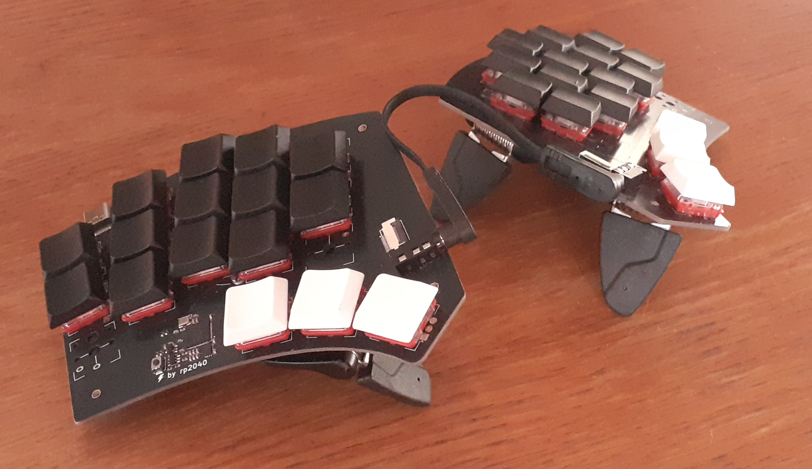

# Quacken

Libre, ergonomic, *polymorphic*: a single PCB for many possible layouts.

[3×6, 3×5, hummingbird, and everything in between](https://html-preview.github.io/?url=https%3A%2F%2Fgithub.com%2FOneDeadKey%2FQuacken%2Fblob%2Fmain%2Findex.html).

## Roadmap

- [x] onboard RP2040 (left) and I/O expander (right)
- [x] splittable in two (I²C communication over a TRRS cable)
- [x] splittable outer columns
- [ ] hotswap sockets
- [ ] optional Circle Trackpad
- [x] optional rotary encoders
